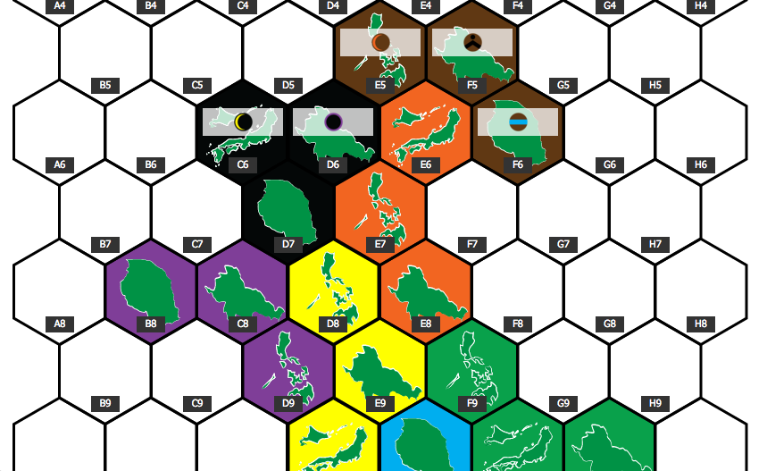

SHATTERED SEAS MEGAGAME MAP
===========================

This two-page Node.js web application was created for an event held by the [Cleveland Megagame Council](http://www.clevelandmegagame.com/) on January 21, 2016. It was roughly hacked together over the course of two days by [Jon Stout](http://www.jonstout.net), based on designs by Jeremy Paul and Christopher Hisey.

The first page of the app is a self-updating map that takes its base data from a [Google Sheets](https://www.google.com/sheets/about/) workbook, made available via the Google Sheets API. The server routinely polls data from the spreadsheet, creates a complex object to represent the game state, then saves that information in a [MongoDB](https://www.mongodb.org/)/[Mongoose ORM](http://mongoosejs.com/) database. The client-side map then refreshes itself from the server's copy of the data via AJAX on a regular basis. This was done to help create a record of the game as it changed over the course of the day.

The app's second page uses the saved game history to create a [Civilization](http://www.civilization5.com/)-like replay of the event as it happened on a minute-by-minute basis. Roughly 128 changes to the map were recorded over the course of eight hours. The presentation can be presently viewed at [https://quiet-spire-95700.herokuapp.com/review](https://quiet-spire-95700.herokuapp.com/review).

All specific ids, paths and service account credentials have been removed from this copy of the repository for obvious reasons. This code is nonfunctional and shared purely for demonstration purposes.

## Dependencies
* [Node.js](https://nodejs.org/)
* [Express](http://expressjs.com/)
* [Mongoose](http://mongoosejs.com/)
* [Express Handlebars](https://github.com/ericf/express-handlebars) / [Handlebars](http://handlebarsjs.com/)
* [edit-google-spreadsheet](https://github.com/jpillora/node-edit-google-spreadsheet)
* [body-parser](https://github.com/expressjs/body-parser)
* [helmet](https://github.com/helmetjs/helmet)
* [Knockout](http://knockoutjs.com/)
* [jQuery](https://jquery.com/)
* [Bootstrap](http://getbootstrap.com/)
* [Grunt](http://gruntjs.com/)
* [Jasmine](http://jasmine.github.io/)
* [Underscore.js](http://underscorejs.org/)

## License
The MIT License (MIT)
Copyright (c) 2016 [Jon Stout](http://www.jonstout.net/)

Permission is hereby granted, free of charge, to any person obtaining a copy of this software and associated documentation files (the "Software"), to deal in the Software without restriction, including without limitation the rights to use, copy, modify, merge, publish, distribute, sublicense, and/or sell copies of the Software, and to permit persons to whom the Software is furnished to do so, subject to the following conditions:

The above copyright notice and this permission notice shall be included in all copies or substantial portions of the Software.

THE SOFTWARE IS PROVIDED "AS IS", WITHOUT WARRANTY OF ANY KIND, EXPRESS OR IMPLIED, INCLUDING BUT NOT LIMITED TO THE WARRANTIES OF MERCHANTABILITY, FITNESS FOR A PARTICULAR PURPOSE AND NONINFRINGEMENT. IN NO EVENT SHALL THE AUTHORS OR COPYRIGHT HOLDERS BE LIABLE FOR ANY CLAIM, DAMAGES OR OTHER LIABILITY, WHETHER IN AN ACTION OF CONTRACT, TORT OR OTHERWISE, ARISING FROM, OUT OF OR IN CONNECTION WITH THE SOFTWARE OR THE USE OR OTHER DEALINGS IN THE SOFTWARE.